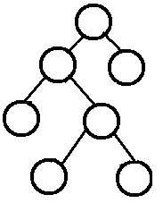
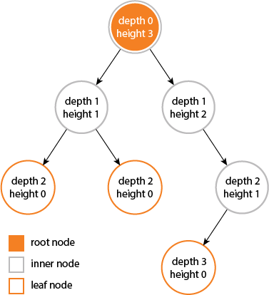
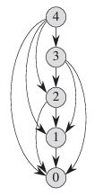
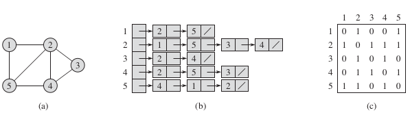
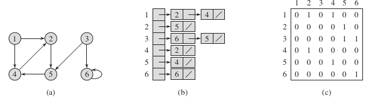

# Introduction To Algorithim

Study notes and code written for each chapter while reading the book **Introduction To Algorithim - 3rd Edition**

# Table of contents

1. [Foundatios](#foundations)
    1. [Role of Algorithims in Computing](#role-algo)
    2. [Getting Started](#getting-started)
    3. [Growth of Functions](#function-growth)
    4. [Divide-And-Conquer](#divide-conquer)
    5. [Probabilistic Analysis and Randomized Algorithms](#prob-rand-algo)
2. [Sorting and Order Statistics](#sorting)
    1. [Heapsort](#heapsort)
    2. [Quicksort](#quicksort)
    3. [Sorting in Linear Time](#linear-time-sort)
    4. [Medians and Order Statistics](#median-order-stat)
3. [Data Structures](#data-structures)
    1. [Elementary Data Structures](#elementary-data-structures)
    2. [Hash Tables](#hashtable)
    3. [Binary Search Trees](#bst)
    4. [Augmenting Data Structures](#augment-data-structure)
4. [Advanced Design and Analysis Techniques](#adv-analysis-design)
    1. [Dynamic Programming](#dynamic-prog)
    2. [Greedy Algorithim](#greedy-algo)
    3. [Amortized Analysis](#amort-analysis)
5. [Advanced Data Structures](#adv-data-structure)
    1. [B-Trees](#b-tress)
    2. [Fibonacci Heaps](#fibonacci-heaps)
    3. [Van Ende Boas Trees](#v-e-b-trees)
    4. [Data Structures for Disjoint sets](#disjoint-sets)
6. [Graph Algorithims](#graphs)
    1. [Elemantary Graph Algorithim](#elem-graph-algo)
    2. [Minimum Spanning Trees](#min-spanning-trees)
    3. [Single-Source Shortest Paths](#single-source-shortest-path)
    4. [All-Pairs Shortest Paths](#all-pairs-shortest-path)
    5. [Maximum FLow](#max-flow)
7. [Selected Topics](#selected-topics)
    1. [Mutithreaded Algorithim](#muti-thread-algo)
    2. [Matrix Operations](#matrix-operations)
    3. [Linear Programming](#linear-programming)
    4. [Polynomials and the FFT](#polynomials-fft)
    5. [Number-Theoretic Algorithims](#number-theory)
    6. [String Matching](#string-matching)
    7. [Computational Geometry](#compute-geometry)
    8. [NP-Completeness](#np-complete)
    9. [Approximation Algorithims](#approx-algo)
8. [Mathematical Background](#math-background)
    1. [Summations](#summations)
    2. [Sets](#sets)
    3. [Counting and Probability](#counting-probability)
    4. [Matrices](#matrices)


# Foundation <a name="foundations"></a>

## Role of Algorithims in Computing <a name="role-algo"></a>

Algorithms, an algorithm is any well-defined computational procedure that takes some value, or set of values, as input and produces some value, or set of values, as output. An algorithm is thus a sequence of computational steps that transform the input into the output.

## Getting Started <a name="getting-started"></a>
TODO##

## Growth of Functions <a name="function-growth"></a>
TODO##

## Divide-And-Conquer <a name="divide-conquer"></a>
TODO##

## Probabilistic Analysis and Randomized Algorithms <a name="prob-rand-algo"></a>
TODO##

# Sorting and Order Statistics <a name="sorting"></a>

## Heapsort <a name="heapsort"></a>
TODO##

## Quicksort <a name="quicksort"></a>
TODO##

## Sorting in Linear Time <a name="linear-time-sort"></a>
TODO##

## Medians and Order Statistics <a name="median-order-stat"></a>
TODO##

# Data Structures <a name="data-structures"></a>

## Elementary Data Structures <a name="elementary-data-structures"></a>

### Stack

### Queue

### Linked List

### Binary Tree

In computer science, a binary tree is a tree data structure in which each node has at most two children, which are referred to as the left child and the right child.

#### Types of binary trees

- A **rooted** binary tree has a root node and every node has at most two children.
- A **full** binary tree (sometimes referred to as a **proper** or **plane** binary tree)is a tree in which every node has either 0 or 2 children. Another way of defining a full binary tree is a recursive definition.

    

- In a **complete** binary tree every level, except possibly the last, is completely filled, and all nodes in the last level are as far left as possible. It can have between 1 and 2h nodes at the last level h. An alternative definition is a perfect tree whose rightmost leaves (perhaps all) have been removed.

    

- A **perfect** binary tree is a binary tree in which all interior nodes have two children and all leaves have the same depth or same level.
- A **balanced** binary tree is a binary tree structure in which the left and right subtrees of every node differ in height by no more than 1.One may also consider binary trees where no leaf is much farther away from the root than any other leaf.

#### Tree Operations/Properties

##### Height and Depth

1. The **depth** of a node is the number of edges from the node to the tree's root node. A root node will have a depth of 0.
2. The **height** of a node is the number of edges on the longest path from the node to a leaf.A leaf node will have a height of 0.
3. The **diameter (or width)** of a tree is the number of nodes on the longest path between any two leaf nodes. The tree below has a diameter of 5 nodes.

    

    __Algorithim__

    ```NA
    height()
    1. If tree is empty then return 0
    2. Else
        (a) Get the max depth of left subtree recursively  i.e., call height( tree->left-subtree)
        (a) Get the max depth of right subtree recursively  i.e., call height( tree->right-subtree)
        (c) Get the max of max depths of left and right subtrees and add 1 to it for the current node.
            max_depth = max(max dept of left subtree, max depth of right subtree) + 1
        (d) Return max_depth
    ```

    __Example Tree__

    >
                1
            2       3
        4       5
    >
    See the below diagram for more clarity about execution of the recursive function height() for above example tree.
    ```NA
    height('1') = max(height('2'), height('3')) + 1  = 2 + 1
                                    /    \
                                  /         \
                                /             \
                              /                 \
                            /                     \
                height('2')                 height('3') = 1
    = max(height('4'), height('5')) + 1
    = 1 + 1   = 2
                    /    \
                  /        \
                /            \
              /                \
            /                    \
    height('4') = 1     height('5') = 1
    ```
    __Implementation__
    Code to calculate height & maximum depth of a binary tree can be found [C](./ch03/tree.c) / [Java](./ch03/Tree.java) / [Go](./ch03/go/tree.go)
    > Method : height() & depth()

##### Subtree

  A subtree(S) of a tree T is a tree consisting of a node in T and all of its descendants in T. The subtree corresponding to the root node is the entire tree

  __Implementation__
  Code to check if tree S is a subtree of T can be found [C](./ch03/tree.c) / [Java](./ch03/Tree.java) / [Go](./ch03/go/tree.go)
  > Method : isSubtree()

#### Complexity Analysis Cheatsheet

Operation      | Best case       | Worst Case     | Average case   | Space
:------------: | :-------------: | :------------: | :------------: | :------:
height()       | O(n)            | O(n)           | O(n)           | O(n)
depth()        | O(n)            | O(n)           | O(n)           | O(n)


## Hash Tables <a name="hashtable"></a>
TODO##

## Binary Search Trees <a name="bst"></a>
TODO##

## Augmenting Data Structures <a name="augment-data-structure"></a>
TODO##

# Advanced Design and Analysis Techniques <a name="adv-analysis-design"></a>

## Dynamic Programming <a name="dynamic-prog"></a>

A dynamic-programming algorithm solves each subsubproblem just once and then saves its answer in a table, thereby avoiding the work of recomputing the answer every time it solves each subsubproblem. Wetypically apply dynamic programming to optimization problems. Such problems can have many possible solutions. Each solution has a value, and we wish to f ind a solution with the optimal (minimum or maximum) value. We call such a solution an optimal solution to the problem, as opposed to the optimal solution, since there may be several solutions that achieve the optimal value. When developing a dynamic-programming algorithm, we follow a sequence of four steps:

1. Characterize the structure of an optimal solution.
2. Recursively define the value of an optimal solution.
3. Compute the value of an optimal solution, typically in a bottom-up fashion.
4. Construct an optimal solution from computed information.

Dynamic programming thus uses additional memory to save computation time; it serves an example of a **time-memory trade-off**.The savings may be dramatic: an exponential-time solution may be transformed into a polynomial-time solution. A dynamic-programming approach runs in polynomial time when the number of distinct subproblems involved is polynomial in the input size and we can solve each such subproblem in polynomial time.

Steps 1–3 form the basis of a dynamic-programming solution to a problem. If we need only the value of an optimal solution, and not the solution itself, then we can omit step 4. When we do perform step 4, we sometimes maintain additional information during step 3 so that we can easily construct an optimal solution.

There are usually two equivalent ways to implement a dynamic-programming approach.

- **Top-down with memoization**
    In this approach, we write the procedure recursively in a natural manner, but modified to save the result of each subproblem (usually in an array or hash table). The procedure now first checks to see whether it has previously solved this subproblem. If so, it returns the saved value, saving further computation at this level; if not, the procedure computes the value in the usual manner. We say that the recursive procedure has been memoized; it “remembers” what results it has computed previously.

- **Bottom-up method**
    This approach typically depends on some natural notion of the “size” of a subproblem, such that solving any particular subproblem depends only on solving “smaller” subproblems. We sort the subproblems by size and solve them in size order, smallest first. When solving a particular subproblem, we have already solved all of the smaller subproblems its solution depends upon, and we have saved their solutions. We solve each subproblem only once, and when we first see it, we have already solved all of its prerequisite subproblems.

### Example Problems

- **Rod cutting problem**

    Given a rod of length n inches and a table of prices p<sub>i</sub> for i = 1,2,....,n. determine the maximum revenue r<sub>n</sub> obtainable by cutting up the rod and selling the pieces. Note that if the price p<sub>n</sub> for a rod of length n is large enough, an optimal solution may require no cutting at all.

    length i     |1|2|3|4|5|6|7|8|9|10
    ------------ |--|--|--|--|--|--|--|--|--|--|
    price p<sub>i</sub>|1|5|8|9|10|17|17|20|24|30

    A sample price table for rods. Each rod of length i inches earns the company p<sub>i</sub> dollars of revenue.

    __Subproblem Graph__
    When we think about a dynamic-programming problem, we should understand the set of subproblems involved and how subproblems depend on one another. The subproblem graph for the problem embodies exactly this information. Below picture shows the subproblem graph for the rod-cutting problem with n = 4. It is a directed graph, containing one vertex for each distinct subproblem. 

    

    The bottom-up method for dynamic programming considers the vertices of the subproblem graph in such an order that we solve the subproblems y adjacent to a given subproblem x before we solve subproblem x. In a bottom-up dynamic-programming algorithm, we consider the vertices of the subproblem graph in an order that is a **reverse topological sort** or a **topological sort of the transpose** of the subproblem graph. In other words, no subproblem is considered until all of the subproblems it depends upon have been solved. Similarly, using notions from the same chapter, we can view the top-down method (with memoization)for dynamic programming as a “depth-first search” of the subproblem graph

    The size of the subproblem graph G=(V,E) can help us determine the running time of the dynamic programming algorithm. Since we solve each subproblem just once, the running time is the sum of the times needed to solve each subproblem. Typically, the time to compute the solution to a subproblem is proportional to the degree (number of outgoing edges) of the corresponding vertex in the subproblem graph,and the number of subproblems is equal to the number of vertices in the subproblem graph. In this common case, the running time of dynamic programming is linear in the number of vertices and edges.

    __Implementation__
    [C](./ch04/dynamic_programming/cut_rod.c) / [Java](./ch04/dynamic_programming/CutRod.java) / [Go](./ch04/dynamic_programming/go/cut_rod.go)
    > Methods: cut_rod() , cut_rod_memoized() , cut_rod_bottom_up()

## Greedy Algorithim <a name="greedy-algo"></a>
TODO##

## Amortized Analysis <a name="amort-analysis"></a>
TODO##

# Advanced Data Structures <a name="adv-data-structures"></a>

## B-Trees <a name="b-trees"></a>
TODO##

## Fibonacci Heaps <a name="fibonacci-heaps"></a>
TODO##

## Van Ende Boas Trees <a name="v-e-b-trees"></a>
TODO##

## Data Structures for Disjoint sets <a name="disjoint-sets"></a>
TODO##

# Graph Algorithims <a name="graphs"></a>

## Elemantary Graph Algorithim <a name="elem-graph-algo"></a>

We can choose between two standard ways to represent a graph G = (V, E): as a collection of **adjacency lists** or as an **adjacency matrix**. Either way applies
to both directed and undirected graphs. Because the adjacency-list representation provides a compact way to represent **sparse** graphs—those for which |E| is much less than |V|^2 — it is usually the method of choice.

We may prefer an adjacency-matrix representation, however, when the graph is **dense** |E| is close to |V|^2 — or when we need to be able to tell quickly if there is an edge connecting two given vertices.

### Graph Representation

- **Undirected Graph**

    

    __Implementation__
    [C](./ch06/graph.c)
    > Methods: add_edge_undirected()

- **Directed Graph**

    

    __Implementation__
    [C](./ch06/graph.c)
    > Methods: add_edge_directed()


## Minimum Spanning Trees <a name="min-spanning-trees"></a>
TODO##

## Single-Source Shortest Paths <a name="single-source-shortest-path"></a>
TODO##

## All-Pairs Shortest Paths <a name="all-pairs-shortest-path"></a>
TODO##

## Maximum FLow <a name="max-flow"></a>
TODO##

# Selected Topics <a name="selected-topics"></a>

## Mutithreaded Algorithim <a name="muti-thread-algo"></a>
TODO##

## Matrix Operations <a name="matrix-operations"></a>
TODO##

## Linear Programming <a name="linear-programming"></a>
TODO##

## Polynomials and the FFT <a name="polynomials-fft"></a>
TODO##

## Number-Theoretic Algorithims <a name="number-theory"></a>
TODO##

## String Matching <a name="string-matching"></a>
TODO##

## Computational Geometry <a name="compute-geometry"></a>
TODO##

## NP-Completeness <a name="np-complete"></a>
TODO##

## Approximation Algorithims <a name="approx-algo"></a>
TODO##

# Mathematical Background <a name="math-background"></a>

## Summations <a name="math-background"></a>
TODO##

## Sets <a name="sets"></a>
TODO##

## Counting and Probability <a name="counting-probability"></a>
TODO##

## Matrices <a name="matrices"></a>
TODO##